# IoT Plug and Play Code Generation

## Clone Repository (On your Development Machine)

Clone lab contents from Github to your development environment

1. Start VSCode Insider
1. Open local folder  
    If you are still connected to RP4, disconnect from it
    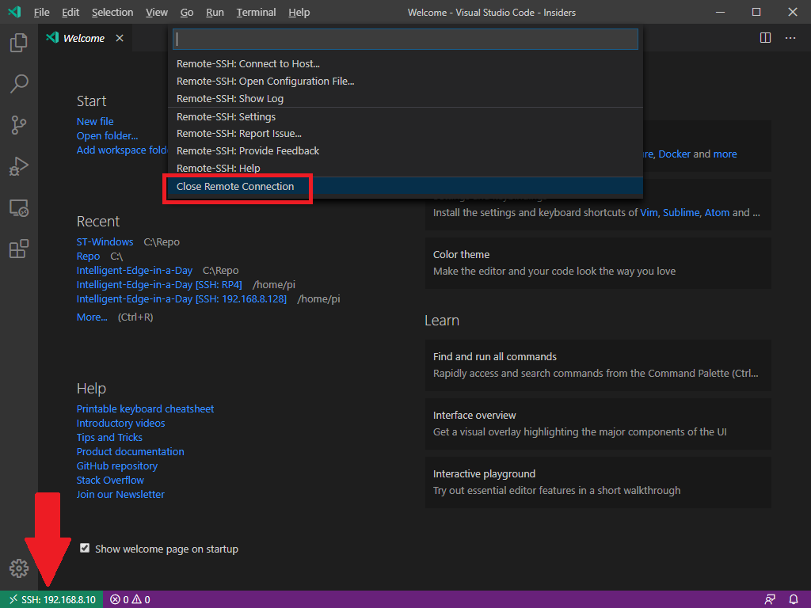
1. In VSCode, click on `Clone Repository` button  
    If you do not see `Explorer` pane, click on 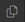 button on the top left corner
1. Enter `https://github.com/awaregroup/Intelligent-Edge-in-a-Day` and hit `enter` key
1. Press `enter` key  
    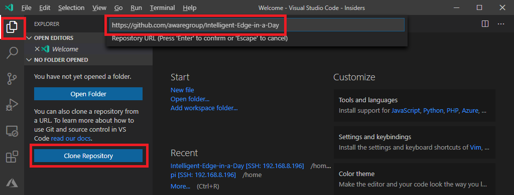
1. Select path where you want to clone the repo  
    This lab assumes you clone to `C:\Repo`

    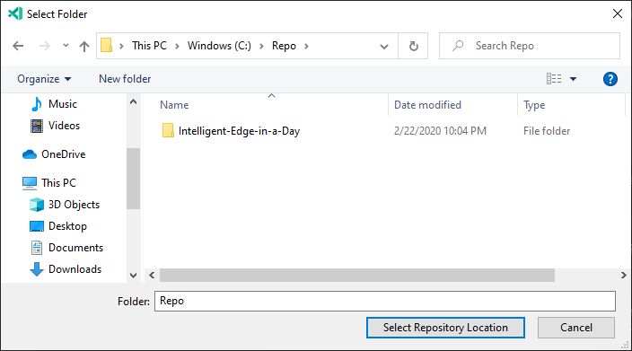

1. Click Open for the prompt  
    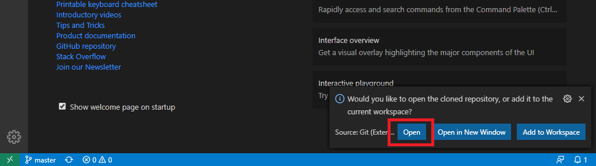

## Install Azure IoT Device Workbench extension

Azure IoT Device Workbench extension include commands for IoT Plug and Play.

1. Display `Extension` pane
1. Enter `iot workbench` to the search box in `Extensions` pane
1. Select `Azure IoT Device Workbench`
1. Click on `Install`  

    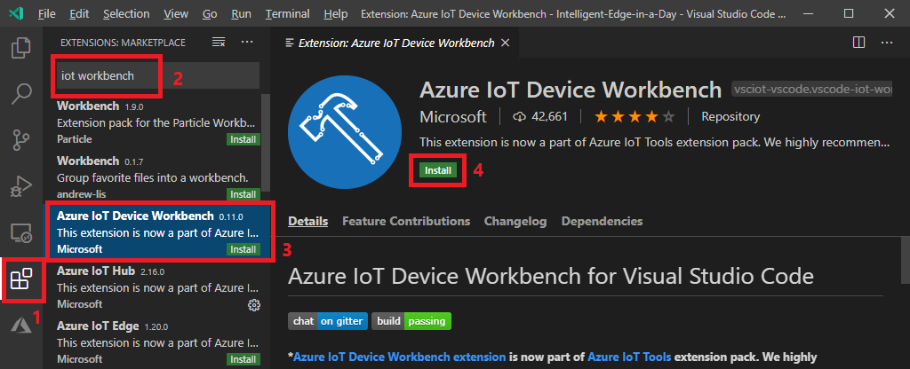  

## Generate Code from Device Capability Model

Device Capability Mode (DCM) describes characteristics, features, functionalities, and properties of the device.  VSCode + Azure IoT Workbench can generate template code from DCM.

The template code contains basics such as :

- Provisioning
- Connection to Azure IoT Hub or IoT Central
- Send messages
- Receive commands
- Send and receive Device Twin

1. In VSCode, open `Command Palette` by pressing `F1` key  
1. Type `plug` in the command palette to see list of IoT Plug and Play commands
1. Select `IoT Plug and Play : Open Model Repository`

      

1. Select `Public repository`  

    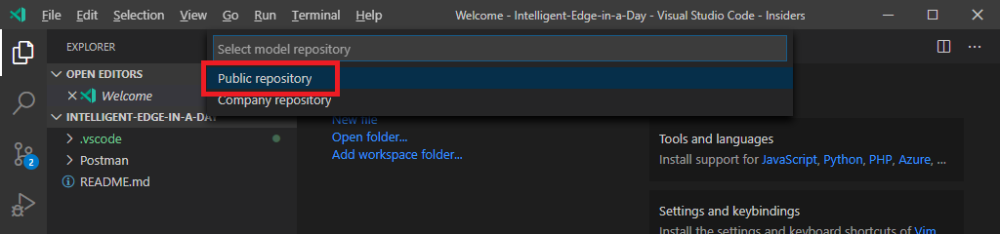  

1. Scroll down or use filter to find `STM Azure1 on SensorTile.Box` from the list

    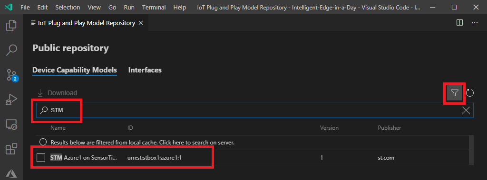  

1. Select `STM Azure1 on SensorTile.Box` and click `Download`

    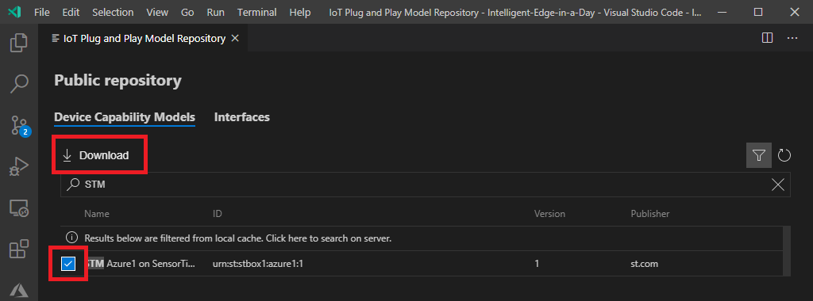  

1. Confirm a json file `urn_st_stbox1_azure1_1.capabilitymodel.json` is downloaded to local folder

    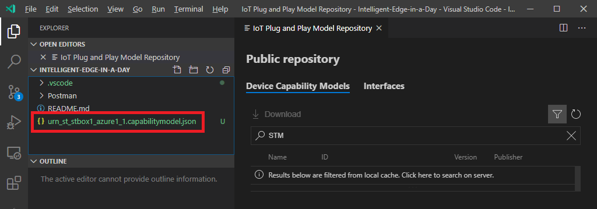  

1. Open `Command Palette` then select `IoT Plug and Play: Generate Device Code Stub...`  

    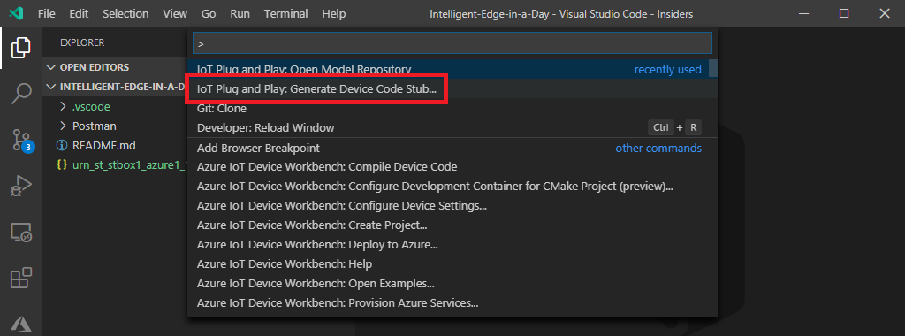

1. Select `urn_st_stbox1_azure1_1.capabilitymodel.json`

    

1. Enter `codegen1` (Case Sensitive) for the project name, then press `Enter` key

    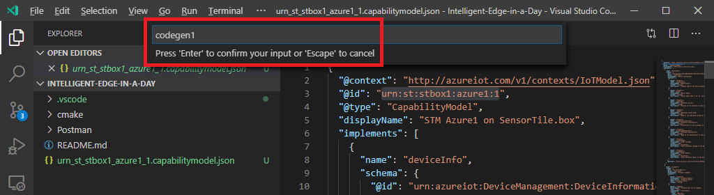

1. Select `ANSI C`

    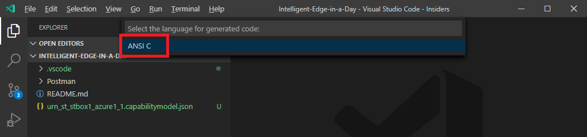

1. Select `Via DPS (Device Provisioning Service) symmetric key`

    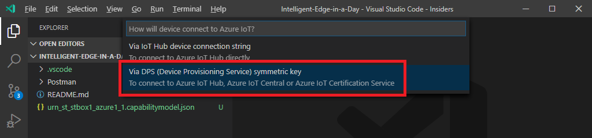

1. Select `CMake Project on Linux`

    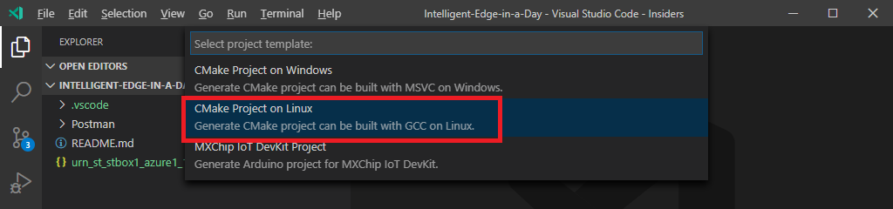

1. Select `Via Source Code`

    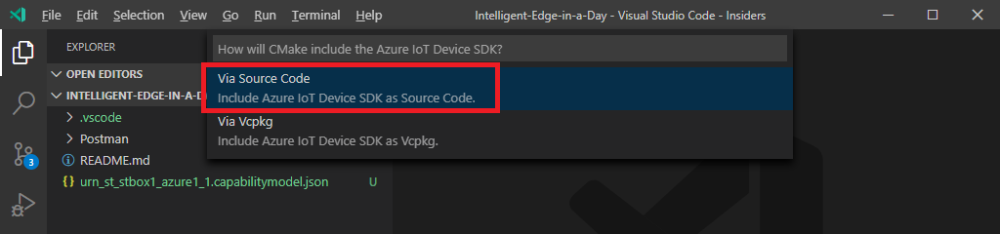

You should see a new VSCode Insiders window with generated code stub.


## Copy Code Stub to RP4

You can set up your development machine to cross compile for Raspberry Pi 4, however, in this lab, we will copy source code and compile on Raspberry Pi 4.

1. Open Terminal window in VSCode  

    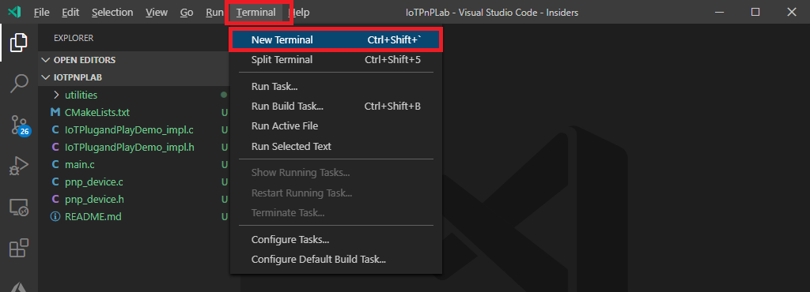

1. In the Terminal window, run scp to copy code stub to RP4 with :

    - Make sure to replace **[IP Address of your RP4]** with IP Address of RP4
    - This command will copy C:\Repo\Intelligent-Edge-in-a-Day\codegen1 on development machine to /home/pi/Intelligent-Edge-in-a-Day/codegen1 on RP4  
  
    ```bash
    scp -r C:\Repo\Intelligent-Edge-in-a-Day\codegen1 pi@[IP Address of your RP4]:/home/pi/Intelligent-Edge-in-a-Day  
    ```

    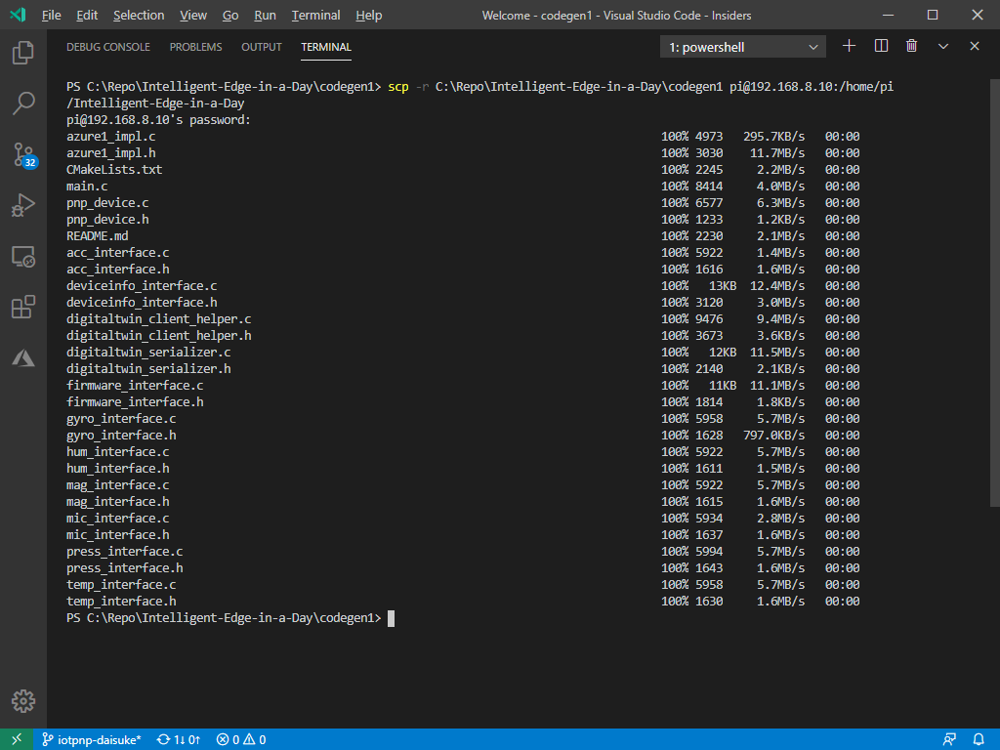
    
1. Connected to RP4 in VSCode

    You should see `codegen1` folder with source code

    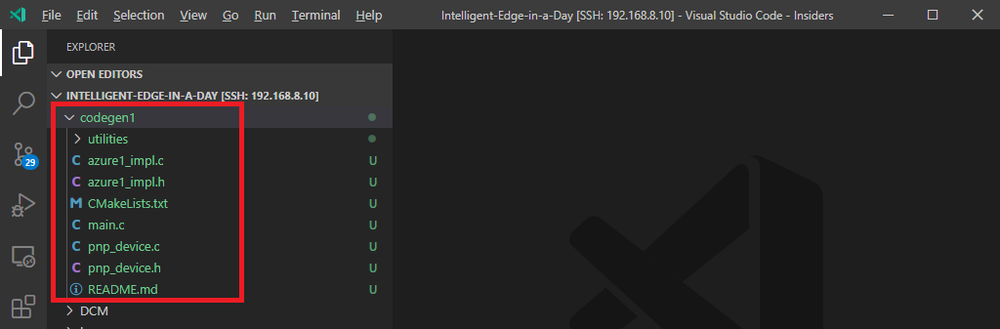

    If you do not see the folder, click `Refresh` button  

    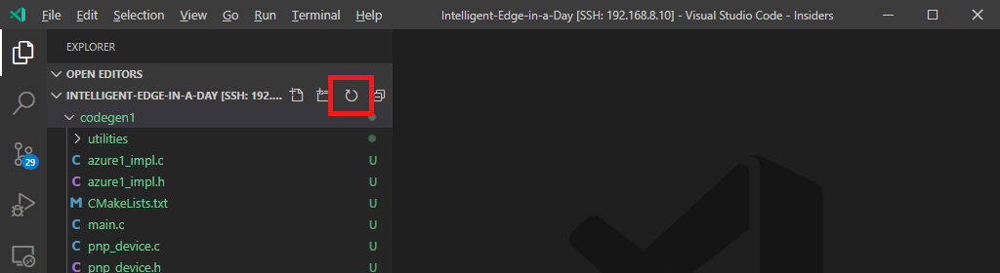

## Compile Code Stub

1. In VSCode Insiders terminal window, configure CMake and build code stub with :

    > [!NOTE]  
    > This may take 3~5 minutes

  ```bashf
  cd /home/pi/Intelligent-Edge-in-a-Day/codegen1
  git clone https://github.com/Azure/azure-iot-sdk-c --recursive -b public-preview
  mkdir cmake
  cd cmake
  cmake .. -Duse_prov_client=ON -Dhsm_type_symm_key:BOOL=ON -Dskip_samples=ON -Dbuild_service_client=OFF
  cmake --build . --config Release
  
  ```

1. Make sure there is no error

    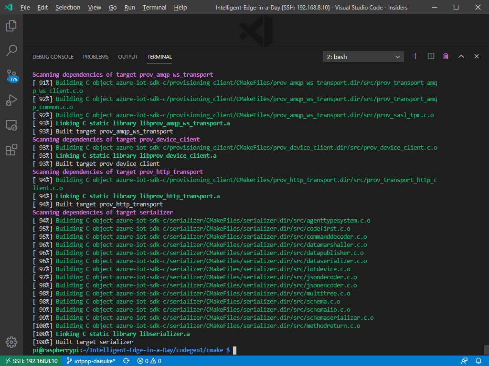

1. Run the application

    Verify the application binary is generated and executable

    > [!NOTE]  
    > Error is expected at this point since this application expects command line parameters

  ```bash
  pi@raspberrypi:~/Intelligent-Edge-in-a-Day/codegen1/cmake $ ./codegen1 
Error: Time:Sun Feb 23 20:35:18 2020 File:/home/pi/Intelligent-Edge-in-a-Day/codegen1/main.c Func:main Line:222 USAGE: codegen1 [Device ID] [DPS ID Scope] [DPS symmetric key]
pi@raspberrypi:~/Intelligent-Edge-in-a-Day/codegen1/cmake $   ```

## Create Device Identity

There are a few options to connect a device to IoT Central.

- Cloud First  
    Create device identity in Cloud
- Device First
    Cloud to create device identity when a new device became online

### Cloud First Connection

Let's connect the application with Cloud First approach.  Later on, we will cover Device First Approach.

1. Open [IoT Central application](https://apps.azureiotcentral.com/myapps)
1. Select your IoT Central application
1. Select `Device templates`
1. Click on `+` sign

    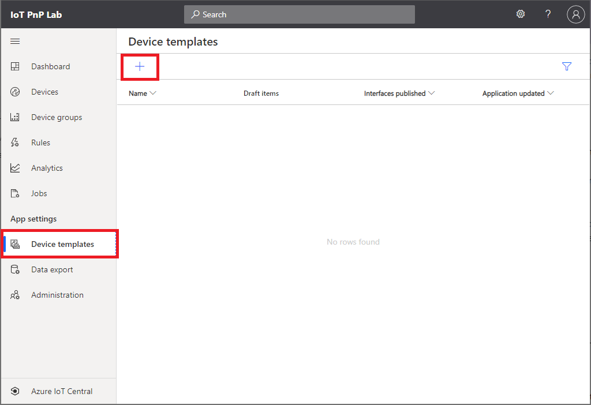

1. Scroll down and select `SensorTIle.Box(STEVAL-MKCBOX1V1)` from IoT Plug and Play pre-certified device list  
1. Click `Next Customize`  

    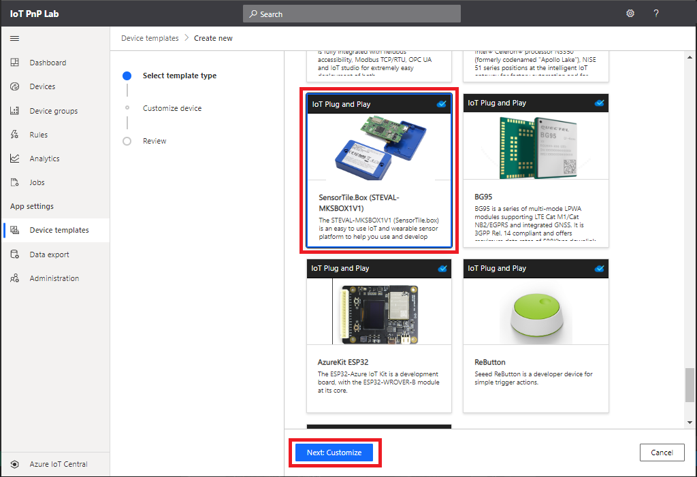

1. Click `Create`

    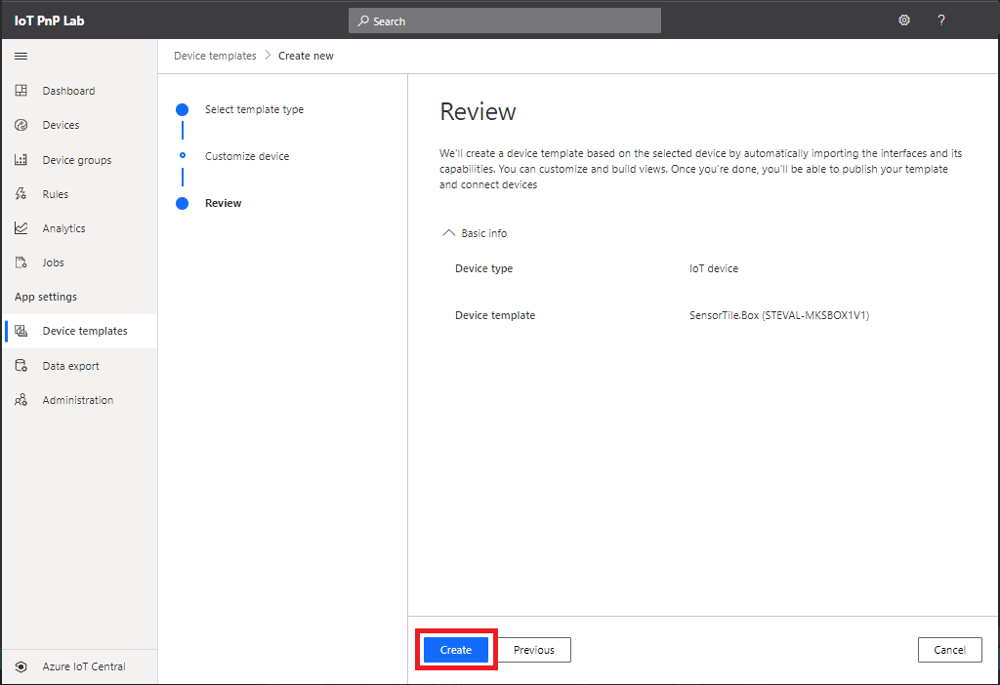

1. Open `Devices` pane, select `SensorTIle.Box(STEVAL-MKCBOX1V1)`, then click `+ New`  

    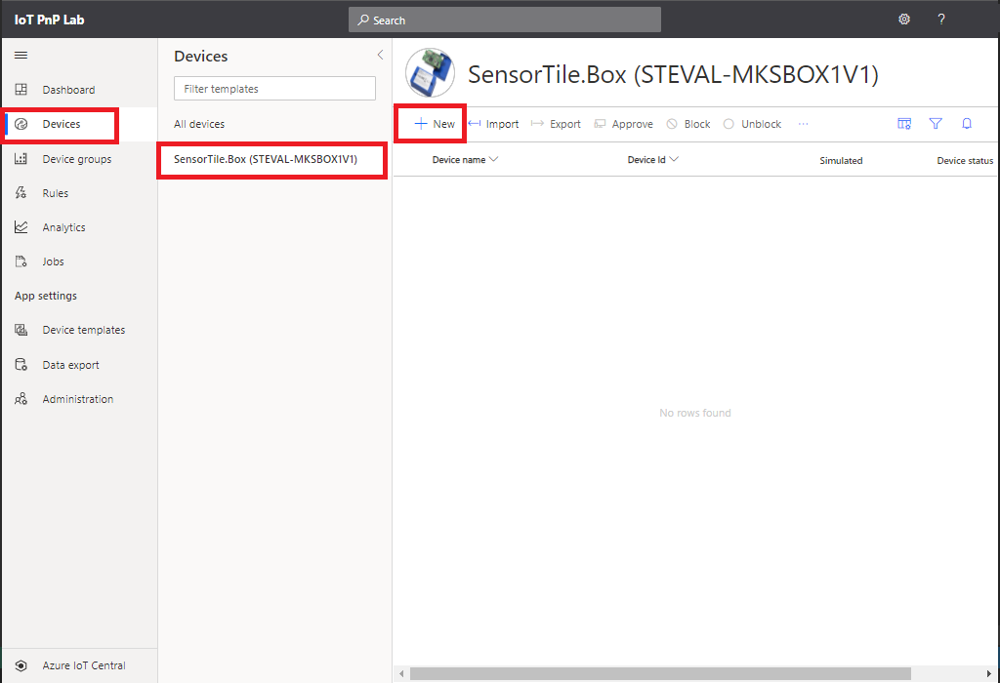

1. Change `Device ID` and `Device Name`, or you can accept default names, then click `Create`  

    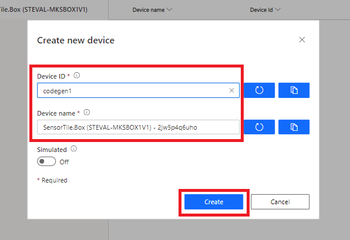

1. Confirm the new device identity is in the devices list  

    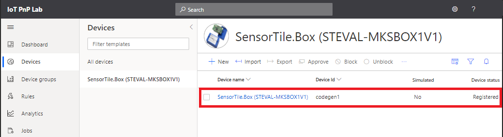

1. Open the device by clicking `Device Name`  

    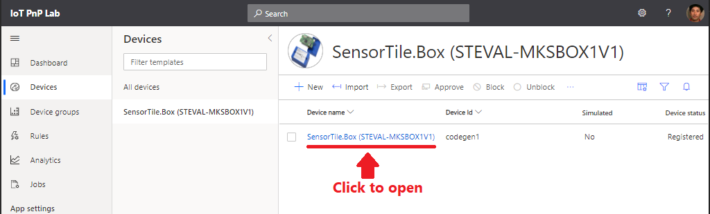

1. Click `Connect`  

    > [!NOTE]
    > Check the status of device is **Registered**  

    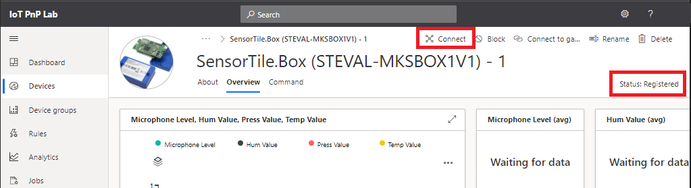

1. Use `ID scope`, `Deivce ID`, and `Primary key` to run the app on RP4

    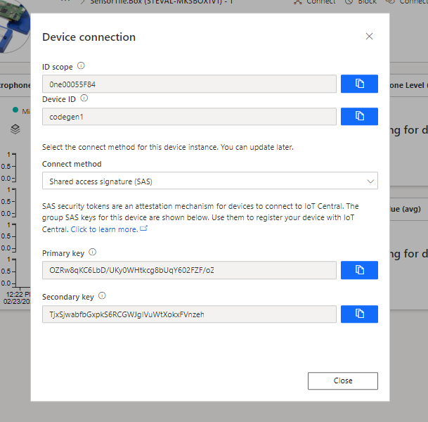  

    Example :  

    ```bash
    ./codegen1 codegen1 0ne00055F84 OZRw8qKC6LbD/UKy0WHtkcg8bUqY602FZF/oZd*/-/-*/*
    ```

Within a few minutes, you should see :

- Telemetry (all zeros) 
- Property values `abc`
- Status is now `Provisioned`
- You can send a command from Cloud  

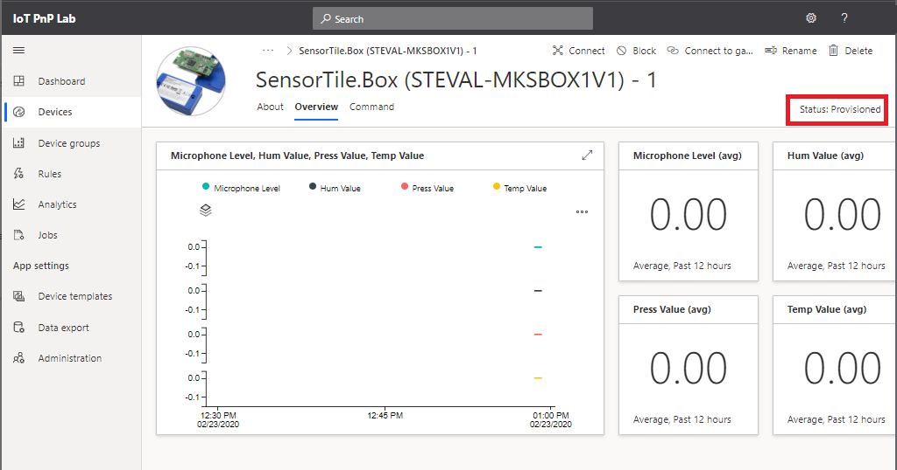

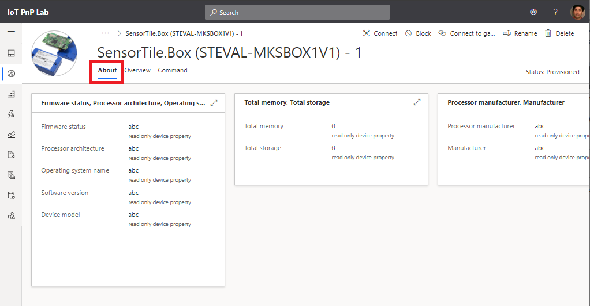

Press `CTRL +  C` to exit app on RP4