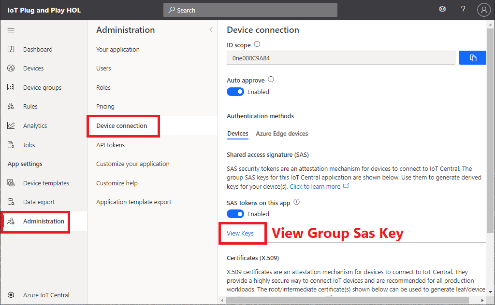
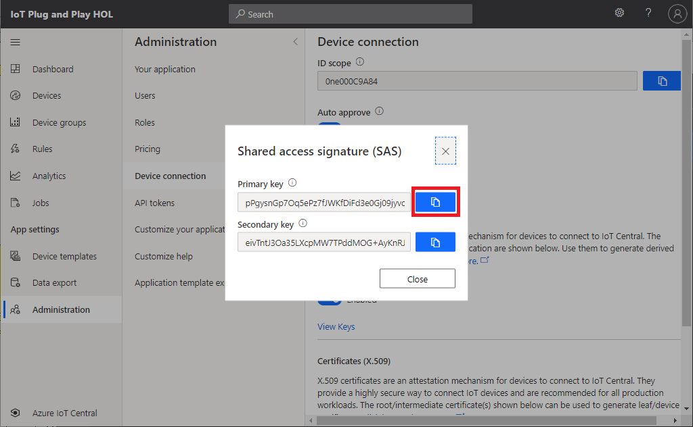

# Device First Provisioning

Cloud first provisioning approach gives the solution owners more control on which devices are allowed to connect to specific solutions.
However, there may be other solutions that you know devices are built for a specific solution.

With Device Provisioning Service, the device app can be written in a way to self register to a solution (or IoT Hub) using Group SAS key.

## Clean up IoT Central

Let's start with clean state.

1. Open Postman and select `5 : Delete Device` and run
1. Verify IoT Central `Codegen HOL API Device` is no longer listed
1. Select `6 : Delete Device Template` from the Postman collection and run
1. Verify IoT Central `Codegen HOL API Demo` is no longer listed

Or

1. Run `Cleanup IoT Central` Postman request

## Modify device code

You can generate device Sas key from device id and groups Sas key.  

> [!IMPORTANT]  
> The group sas key should be saved in secure location for real production device

Let's add code to generate a device sas key from the group sas key.  The the generate device Sas key, we can automate the device provisioning.
Furthermore, with IoT Plug and Play, cloud solution can understand devices' capabilities and characteristics.

1. Copy and replace `main.c`, `azure1_impl.c`, `azure1_impl.h`, `pnp_device.c`, and `pnp_device.h` from `DeviceFirstProvision`  

    ```bash
    cp ~/Intelligent-Edge-in-a-Day/lab02/DeviceFirstProvision/* ~/Intelligent-Edge-in-a-Day/codegen1
    ```

1. Re-compile with :  

    ```bash
    cmake --build . --config Release
    ```

1. Browse to `Device connection` page of IoT Central  

    

1. Click on `View keys` and copy Group Sas Key (Either primary or secondary key)  

    

1. Run the new device app with Group Sas Key

    |Parameter     | Description  | Example  |
    |--------------|---------|---------|
    |Device ID     | An unique device id of your choice                | devicefirstdemo    |
    |Scop ID       | Value from IoT Central in Device connection page  | 0ne000C9A84        |
    |Group Sas Key | Value from IoT Central in Device connection page  | pP9zp+Ew.....      |
    
    ```bash
    ./codegen1 [Device ID] [Scope ID] [Group Sas Key]
    ```

1. Verify the new device is now provisioned and connected in IoT Central application
1. Add view and verify you can see telemetry data such as Temperature and Property Data

## Complete

You just built a device app that can provision without first creating the device identity in Cloud

Look for additional code in :

- main.c for Device First provisioning
- azure1_impl.c/h for device specific code
