# Device Identity : RESTful API

There are a few options to connect a device to IoT Central.

- Cloud First  
    Create device identity in Cloud
- Device First
    Cloud to create device identity when a new device became online

Let's connect the application with Cloud First approach.  Later on, we will cover Device First Approach.

## Cloud First Connection : API Method

### Set up Postman

IoT Central added API support.  As a result, many operations can be automated using API.

1. Open Postman
1. Import Collection  
    [File] -> [Import], then select `IoT Central Preview.postman_collection` in `C:\Repo\Intelligent-Edge-in-a-Day\lab02\Postman` folder
1. Import Environment  
    [File] -> [Import], then select `IoT Central API.postman_environment` in `C:\Repo\Intelligent-Edge-in-a-Day\lab02\Postman` folder

1. Select `IoT Central API` environment  

    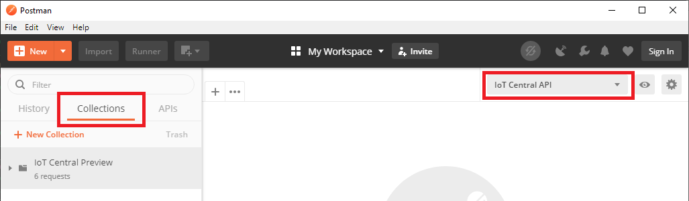

1. Click on eyeball icon, then click `Edit` next to `IoT Central API`  

    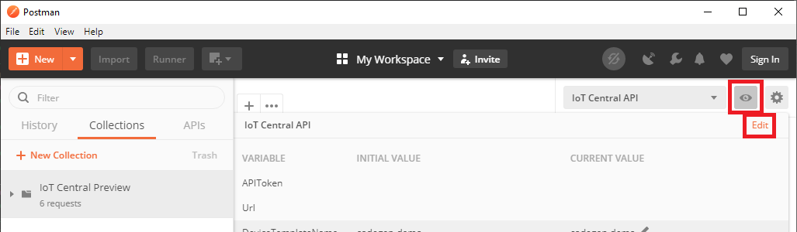

1. Browse to your IoT Central Application
1. Navigate to API tokens page, then click `+` to generate a new API Token  

    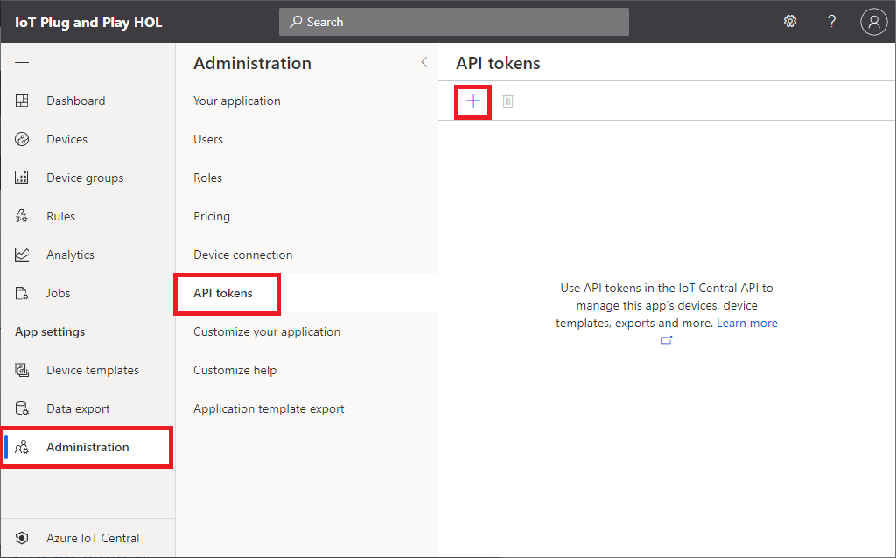

1. Provide a token name then click `Generate`  

    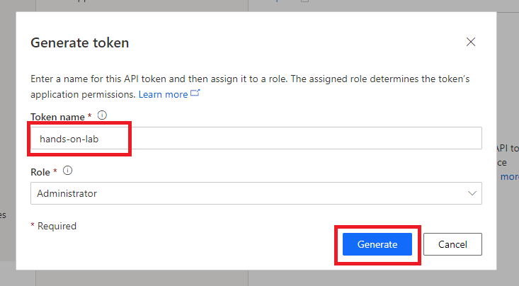

1. Copy the token and past into Postman's `APIToken` Setting  

    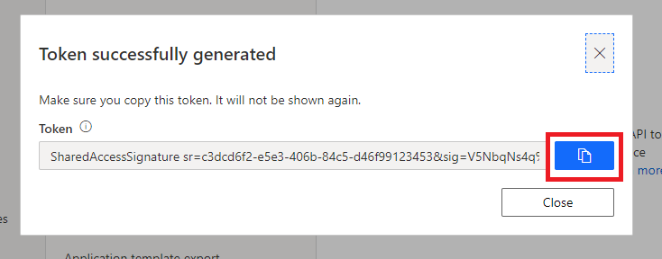

    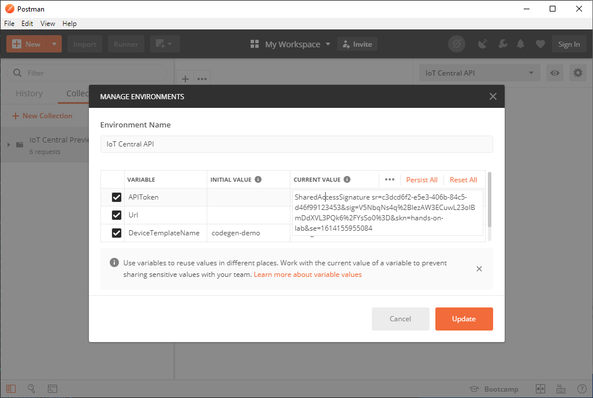

1. Navigate to `Your application` page of IoT Central application  
1. Copy `Application Url` to Postman's `Url` setting, then click `Update`

    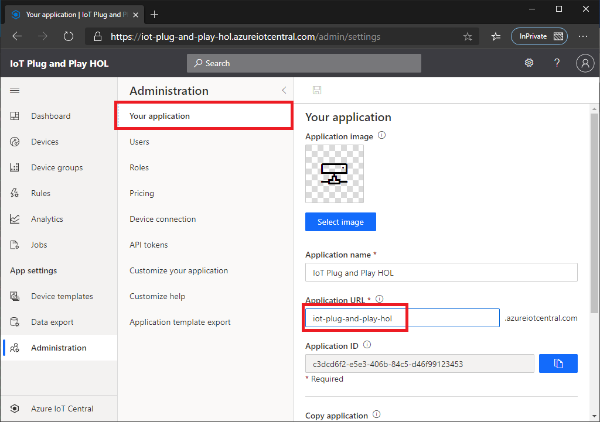

    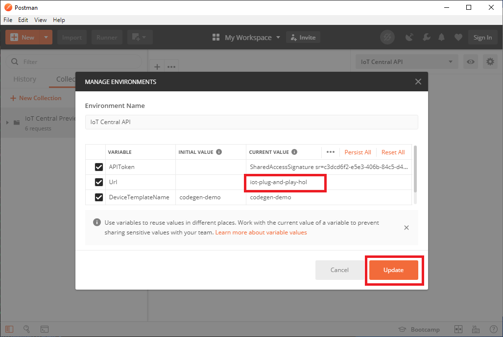

### Test API

Let's verify the setting by making a simple API call to IoT Central

1. From `IoT Cental Preview` collection, click `1 : Get Application`
1. Click `Send` button
1. Verify IoT Central returns successfully with data

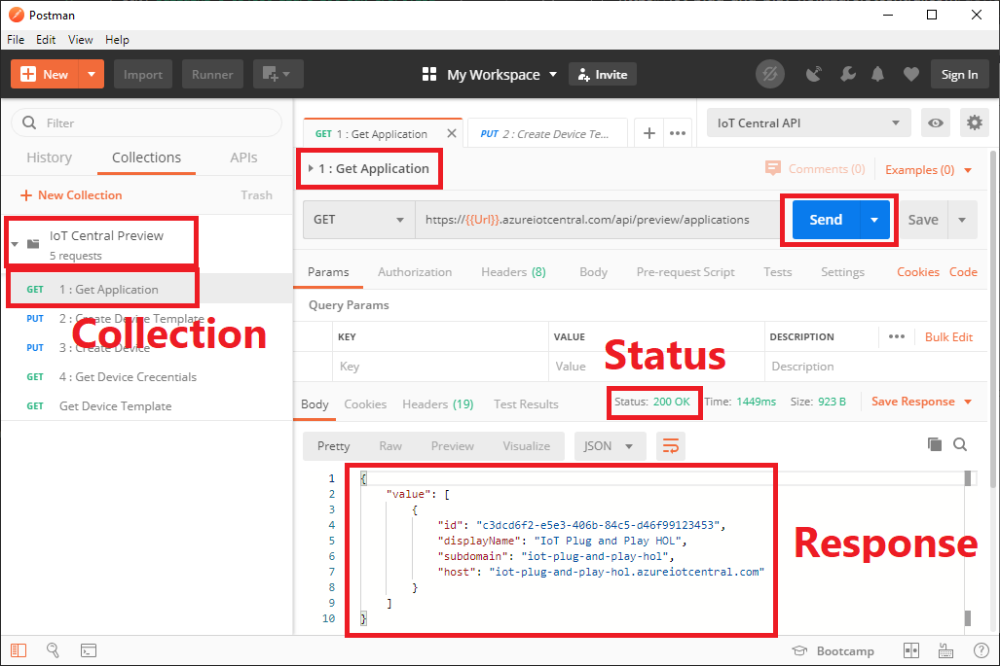

### Create Device Template

1. Browse to `Device template` page of IoT Central Application  
    At this point, there is no template

1. Switch to Postman then from `IoT Cental Preview` collection, click `2 : Create Device Template`
1. Send the request
1. Verify Rest API returns success (200 OK)
1. Browse to `Device templates` page and confirm the device template is created  

    If you do not see the new template, click `Refresh`

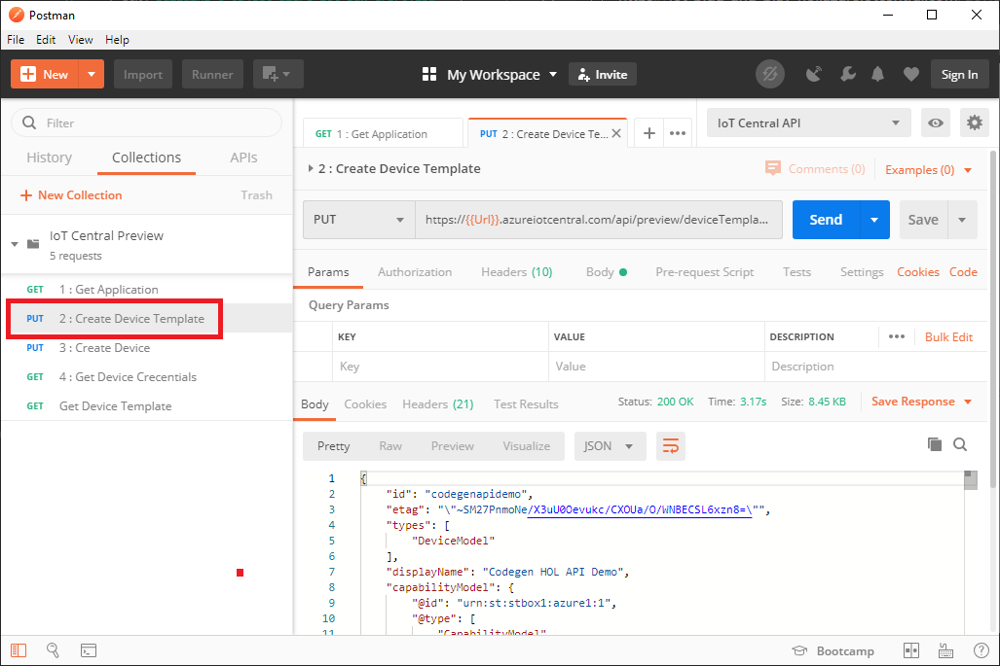

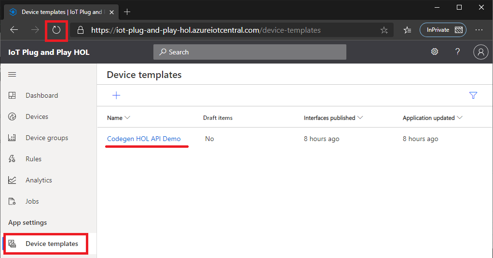

### Create Device Identity

Now with the template just created, we can create a new device

1. From `IoT Cental Preview` collection, click `3 : Create Device`
1. Send the request
1. Verify Rest API returns success (200 OK)
1. Browse to `Devices` page and confirm the new device  with device id `codegenapidemo_device` is created with status `Registered`

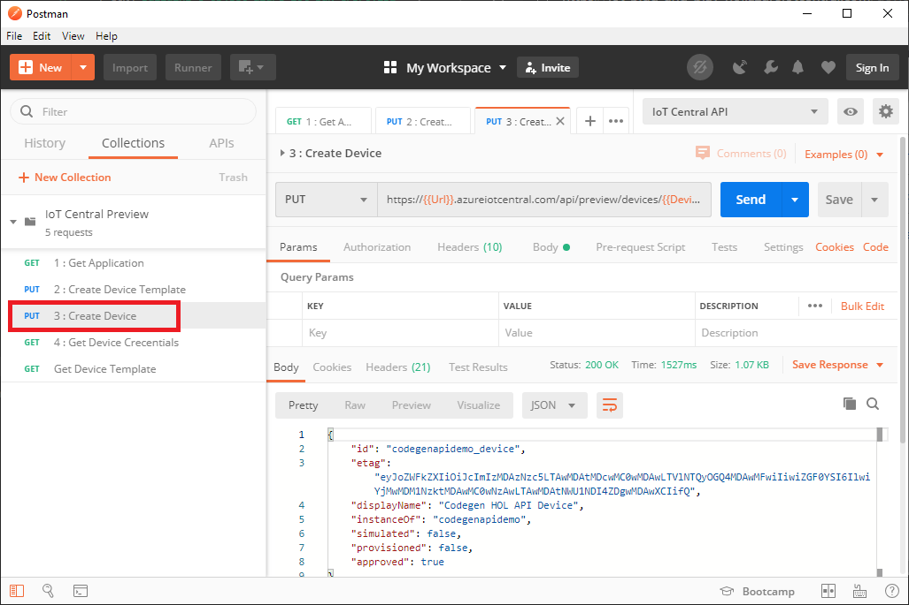

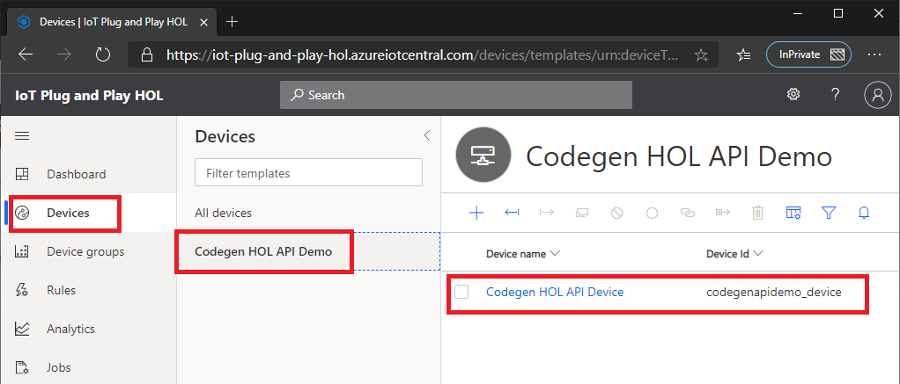

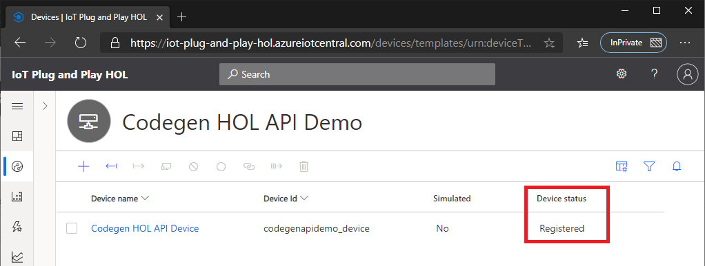

### Retrieve device Sas Key

Now we have a new device identity.  Retrieve device credential (Sas Key) so we can connect.

1. From `IoT Cental Preview` collection, click `4 : Get Device Credentials`
1. Send the request
1. Verify Rest API returns success (200 OK)
1. The API returns `Scope ID` and `Sas Keys`

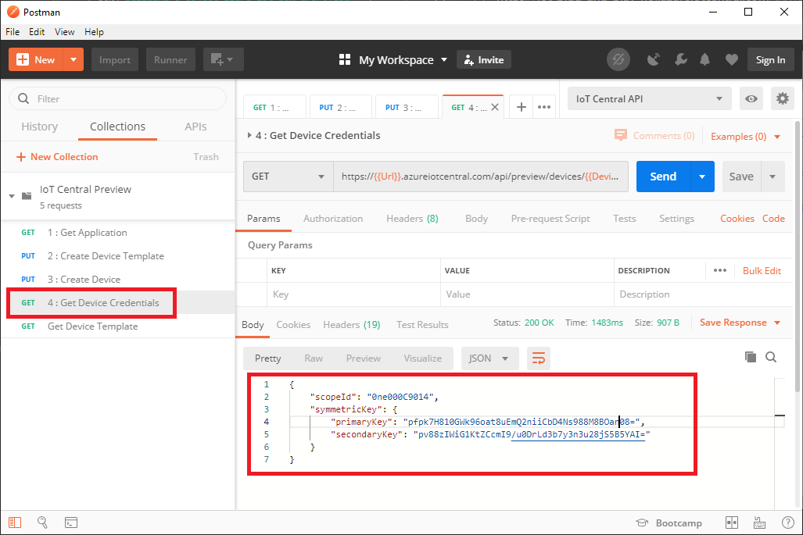

1. Use these device connection information with the device app to connect to IoT Central

    > [!TIP]  
    > Device ID is in the response data of `3 : Create Device` API  
    > if you used the template, the id is `codegenapidemo_device`

    Example :  

    ```bash
    ./codegen1 codegenapidemo_device 0ne000C9014 pfpk7H810GWk96oat8uEmQ2niiCbD4Ns988M8BOan***
    ```

1. Once the device app successfully connected to IoT Central application, the device status will change to `Provisioned`

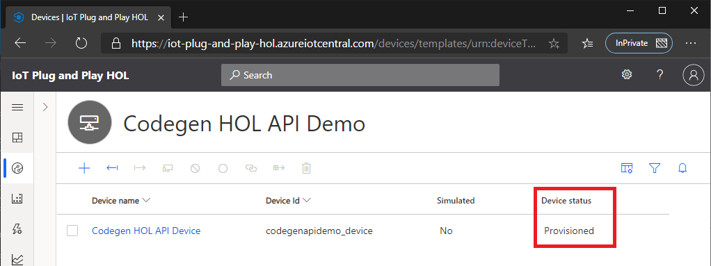

## Adding View to IoT Central

The template does not provide views (graphs etc).  Let's add a new view to the template.
IoT Central can generate `Default view` based on DCM.  You can customize views based on your needs as well.

1. Navigate to `Device templates` view
1. Click on `Codegen HOL API Demo`
1. Select `View` then click `Generate default views`  

    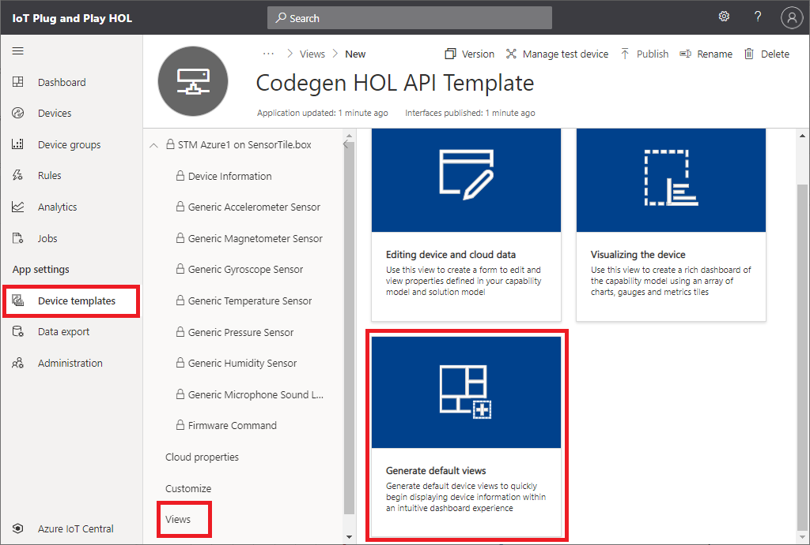

1. Click on `Generate default dashboard view(s)`

    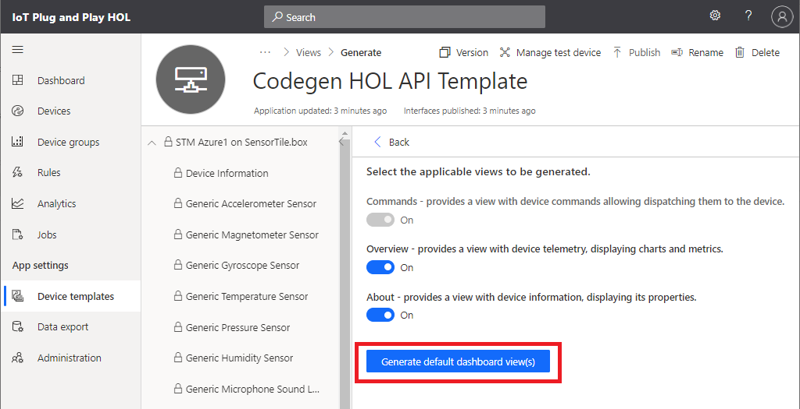

1. Click on `Publish` for the change to take effect  

    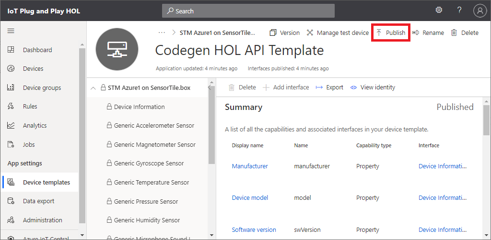

1. Navigate to the device page.  Now you should see `About` and `Overview` tabs  

    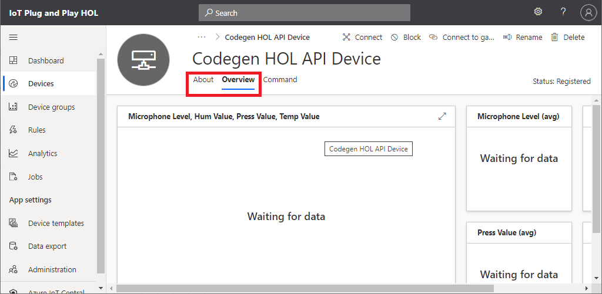