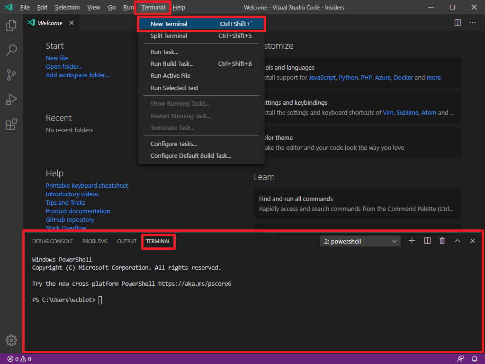
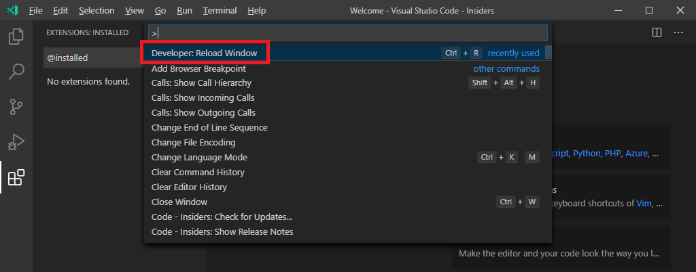
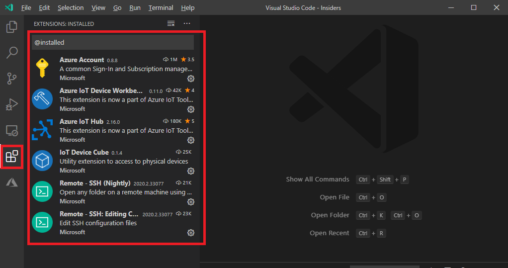
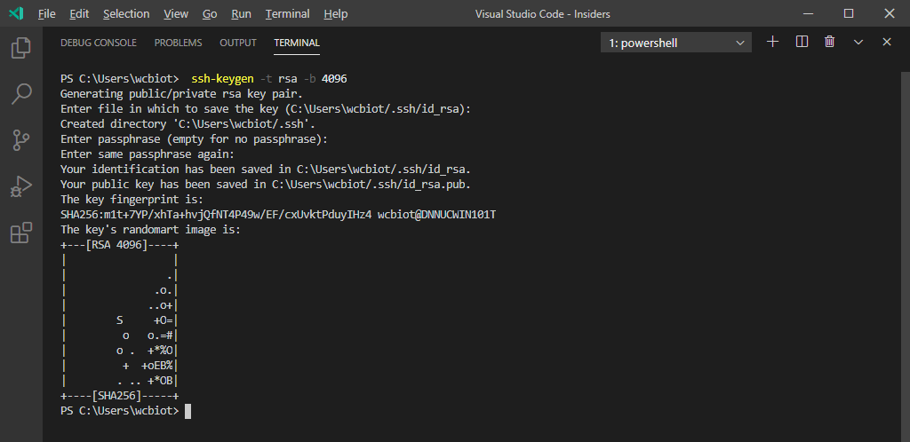
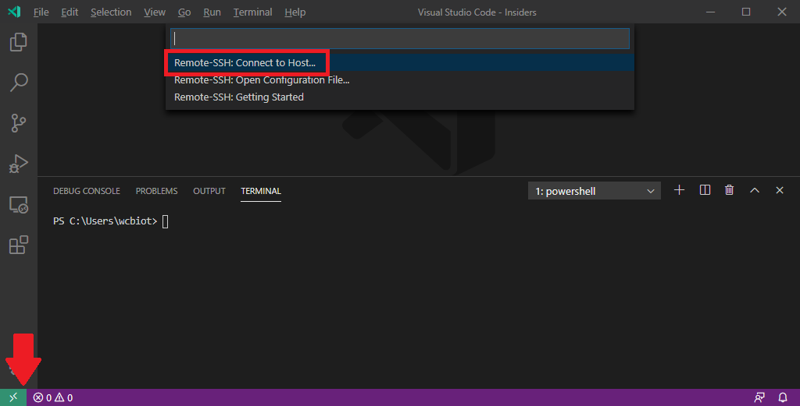
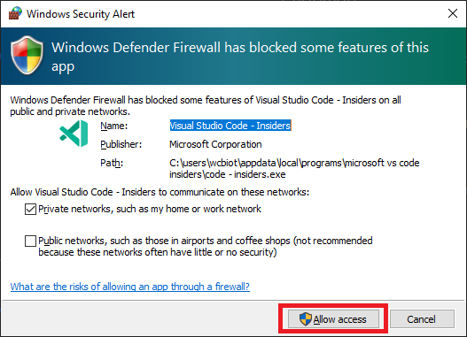
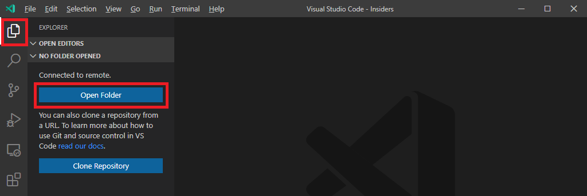
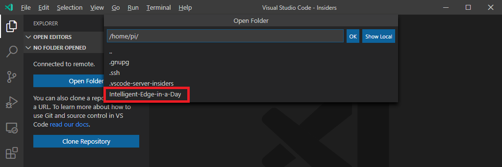
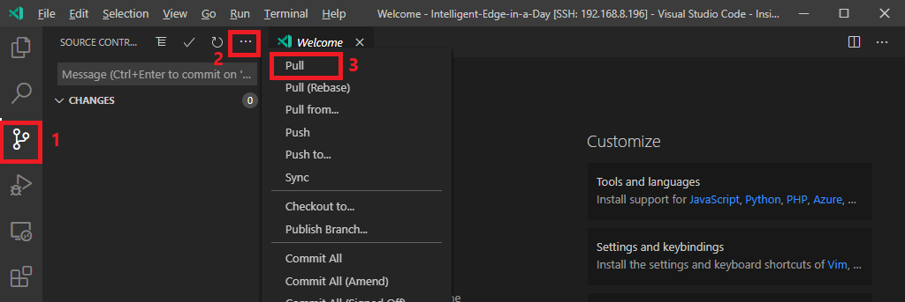

# Prep for IoT PnP

## Requirements

- Windows 10 or Windows Server 2019 1809 or above
- Postman or Curl
- Git client

## Setup your development environment

1. Install [Git](https://git-scm.com/downloads)  
    Or you may use your favorite Git client software
1. Install [Postman](https://www.postman.com/downloads/)
1. Install [Visual Studio Code Insiders Edition](https://code.visualstudio.com/insiders/)
1. Install OpenSSH to your Windows machine from **Windows Powershell (Admin)** with :  

    ```powershell
    Add-WindowsCapability -Online -Name OpenSSH.Client~~~~0.0.1.0
    ```

    Example :

    ```powershell
    PS C:\> Add-WindowsCapability -Online -Name OpenSSH.Client~~~~0.0.1.0

    Path          :
    Online        : True
    RestartNeeded : False
    ```

## VSCode Extensions

We will use several extensions.  Please install following extensions.

> [!TIP]  
> If you already have Production version of (Not Insiders) Visual Studio installed, please make sure you install the extension to Visual Studio Insiders Edition  
> The Insiders edition has Green Icon while production version has blue icon  
>   

- [Remote SSH (Nightly)](https://marketplace.visualstudio.com/items?itemName=ms-vscode-remote.remote-ssh-nightly)  
- [Azure IoT Device Workbench](https://marketplace.visualstudio.com/items?itemName=vsciot-vscode.vscode-iot-workbench)

1. Start VSCode Insiders Edition
1. Open new terminal from [Terminal] Menu -> `New Terminal`  

    You will see new terminal window in the bottom of screen
    

1. From the Terminal Window, install extensions with :  

    ```bash
    code-insiders --install-extension ms-vscode-remote.remote-ssh-nightly --install-extension vsciot-vscode.vscode-iot-workbench
    ```

    

1. Load Extension  

    Open `Command Palette` by pressing `F1` key, then select `Developer: Reload Window`

    

1. Verify extensions are installed in `Extensions` pane  

    

### Set up SSH Key

This is optional but highly recommended so you do not have to enter passwords repeatedly

1. Generate SSH Key from VSCode terminal window with :

    - Accept the default location (C:\Users\[User Name]/.ssh.id_rsa)
    - Optional : Enter password, or leave blank (Just `enter` key)

  ```ps
  ssh-keygen -t rsa -b 4096
  ```

  Example :

  
  
1. Copy SSH Key to RP4
    
    Replace `[RP4 IP Address]` with IP address of your RP4, then run following commands
    
    When you are prompted for password, enter `raspbian` (case sensitive)

    ```dos
    $REMOTEHOST="pi@[RP4 IP Address]"
    scp "$env:USERPROFILE\.ssh\id_rsa.pub" "${REMOTEHOST}:~/tmp.pub"
    ssh "$REMOTEHOST" "mkdir -p ~/.ssh && chmod 700 ~/.ssh && cat ~/tmp.pub >> ~/.ssh/authorized_keys && chmod 600 ~/.ssh/authorized_keys && rm -f ~/tmp.pub"
    ```
    
    Example :  
    
    
    
    If you are using macOS/Linux, copy SSH key with :

    ```bash
    ssh-copy-id pi@[RP4 IP Address]
    ```

### Add Raspberry Pi 4 to Host Configuration

You can add Raspberry Pi 4 to the list of know hosts.  This is a convenient feature so you can simply select (vs. enter IP address repeatedly) to connect to RP4

1. Click  in the bottom left corner of VSCode window
1. Select `Remote-SSH: Connect to Host...`  

    

1. Select `+ Add New SSH Host...`  

    

1. Enter `pi@[IP Address of your RP4]`, then press `enter` key

    

1. Press `Enter` to accept default configuration file  

    

1. Click `Connect` to connect to RP4  

    

### Connect to Raspberry Pi 4

After registering RP4 to configuration file, you can connect to RP4 by selecting from menu

1. Click  in the bottom left corner of VSCode window
1. Select `Remote-SSH: Connect to Host...`  

    

1. Select IP Address of your RP4 from the list  

    

1. Click `Allow access` on Windows Security Alert Popup

    

1. VSCode shows which host you are connected in the left bottom corner  

    

## Open the Lab Contents folder in VSCode

RP4 is prepared with the lab contents repo.  The repo is cloned to `/home/pi/Intelligent-Edge-in-a-Day` folder

1. From `Explorer` pane, select `Open Folder`  
  If you do not see this menu, select `Open Folder...` menu from `File` menu

    

1. Select `Intelligent-Edge-in-a-Day` from the list, then click `OK` or press `Enter` key

    

## Pull the latest contents

Please pull the latest contents from git with :

1. Select `Source Control` pane
1. Click on `...` to display menu
1. Select `pull`

    

## Complete

Your development environment is ready for the rest of lab.

Start [next lab](IoT-PnP-CodeGen.md)

## Reference

> [!TIP]  
> F1 key is the short cut key to display the command pallette  
> Other shortcut keys
> - [Windows Keyboard Shortcuts](https://code.visualstudio.com/shortcuts/keyboard-shortcuts-windows.pdf)
> - [macOS Keyboard Shortcuts](https://code.visualstudio.com/shortcuts/keyboard-shortcuts-macos.pdf)
> - [Linux Keyboard Shortcuts](https://code.visualstudio.com/shortcuts/keyboard-shortcuts-linux.pdf)